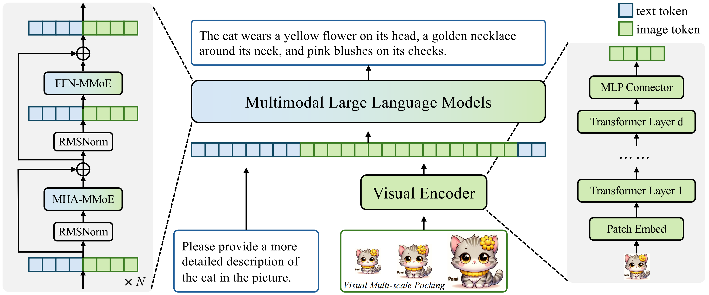
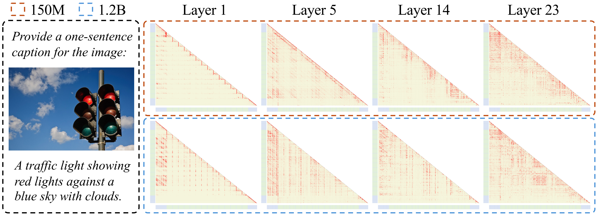

# NaViL: Rethinking Scaling Properties of Native Multimodal Large Language Models under Data Constraints (NeurIPS 2025)

[[📜 Paper]](xxx) [[⭐️Project Page]](xxx) [[🤗 Model]](https://huggingface.co/collections/OpenGVLab/navil-68e62e7d20ea3e4097b56778) [[📝 English Version]](README.md)

## 📖 摘要

在现有的多模态大语言模型（MLLM）中，组合式训练（Compositional Training）已成为主流范式，它通过持续的多模态预训练将预训练好的视觉编码器与语言模型连接起来。然而，由于其分离式的训练方式，探索这种范式的多模态扩展属性（Scaling Property）变得十分困难。

在本文中，我们专注于以端到端方式进行 MLLM 的原生训练（Native Training），并系统性地研究了在数据受限这一实际情况下的模型设计空间和扩展属性。通过对 MLLM 中各种设计选择的深入研究，我们找到了一个能够最佳平衡性能与训练成本的元架构（Meta-architecture）。在此基础上，我们进一步探索了原生 MLLM 的扩展规律，并揭示了视觉编码器和语言模型之间存在正相关的扩展关系。

基于这些发现，我们提出了一个名为 **NaViL** 的原生 MLLM，并结合了一套简洁且经济高效的训练方案。在 14 个多模态基准测试上的实验结果证实，NaViL 的性能与现有顶尖的 MLLM 相当。我们的发现和成果为未来原生 MLLM 的研究提供了深刻的见解。

## 💡 核心洞见 (Core Insights)

我们对原生 MLLM 的设计和扩展属性进行了系统性研究，得出了五个关键结论，这些结论指导了 NaViL 的设计：

1.  **LLM 初始化至关重要**: 从一个预训练好的 LLM 初始化模型，能够极大地加速多模态训练的收敛，并且即便在拥有大量多模态数据的情况下，其性能也通常优于从零开始训练的模型。

<p align="center">

</p>

2.  **MoE 架构行之有效**: 混合专家模型（MoE）能在不增加推理成本（激活参数量）的前提下，显著提升模型处理异构数据的能力和整体性能。我们发现，为注意力和前馈网络（FFN）同时引入模态特定的专家（Modality-specific Experts）效果最佳。

<p align="center">

</p>

3.  **视觉编码器架构的灵活性**: 在给定的参数预算下，视觉编码器的性能在一系列广泛的深度和宽度配置中都接近最优。较浅的编码器在训练早期收敛更快，而较深的编码器在拥有更多数据时表现略好。

4.  **非对称的扩展效应**: 扩展 LLM 的规模能够持续带来多模态性能的提升，符合传统的语言模型扩展定律。然而，扩展视觉编码器的收益是递减的，其性能上限受限于 LLM 的容量。

5.  **视觉与语言的联合扩展定律**: 我们的研究首次揭示，**视觉编码器的最优规模与 LLM 的规模在对数尺度上成正比**。这意味着两者应当被联合扩展，也指出了现有组合式 MLLM 为不同尺寸的 LLM 配备固定大小视觉编码器的次优性。

<p align="center">

</p>

更多内容请参见原文 [paper](xxx).

## 🏗️ NaViL 架构

基于上述洞见，我们构建了 NaViL。它是一个原生的、基于 MoE 的 MLLM，可以进行端到端的训练，并原生支持任意分辨率的图像输入。

<p align="center">

</p>

-   **视觉编码器 (Visual Encoder)**: 负责初步提取视觉信息。
-   **MLP 连接器 (MLP Connector)**: 将视觉特征投影到 LLM 的特征空间。
-   **MoE 扩展的 LLM**: 包含模态特定的注意力（MHA-MMoE）和前馈网络（FFN-MMoE），以更优的方式融合视觉和文本信息。
-   **视觉多尺度打包 (Visual Multi-scale Packing)**: 在推理阶段，通过处理多尺度的图像输入，进一步提升模型的性能。

## 📊 主要结果

我们在 14 个主流的多模态基准测试上对 NaViL 进行了全面评估，涵盖了通用能力、视觉问答、OCR、图表和文档理解等多个维度。

### 与 SOTA 模型的比较

NaViL-2B 和 NaViL-9B 在相近的参数规模下，**平均性能超越了所有已有的原生 MLLM**，并达到了与顶尖组合式 MLLM（如 InternVL-2.5, Qwen2.5-VL）相媲美的水平，展示了我们提出的原生训练范式和扩展定律的优越性。

| 模型 | 激活参数量 | 平均分 | MMVet | MMMU | MMB | MME | MathVista | OCR-B | TextVQA | DocVQA | AI2D | ChartQA | InfoVQA |
| :--- | :--- | :--- | :--- | :--- | :--- | :--- | :--- | :--- | :--- | :--- | :--- | :--- | :--- |
| **_Compositional MLLMs_** |
| [Qwen2.5-VL](https://github.com/QwenLM/Qwen-VL) | 8.2B | 80.2 | 67.1 | 58.6 | 83.5 | 2347 | 68.2 | 864 | 84.9 | 95.7 | 83.9 | 87.3 | 82.6 |
| [InternVL-2.5](https://github.com/OpenGVLab/InternVL) | 8.1B | 77.3 | 62.8 | 56.0 | 84.6 | 2344 | 64.4 | 822 | 79.1 | 91.9 | 84.5 | 84.8 | 75.7 |
| **_Native MLLMs_** |
| [EVEv2](https://github.com/baaivision/EVE) | 7B | 62.3 | 45.0 | 39.3 | 66.3 | 1709 | 60.0* | 702 | 71.1 | 77.4* | 74.8 | 73.9 | 45.8* |
| [SAIL](https://github.com/ByteDance-Seed/SAIL) | 7B | 63.7 | 46.3 | 38.6* | 70.1 | 1719 | 57.0 | 783 | 77.1 | 78.4* | 76.7 | 69.7* | 47.3* |
| **NaViL-2B (ours)** | **2.4B** | **68.8** | **78.3** | **41.8** | **71.2** | **1822** | **50.0** | **796** | **76.9** | **85.4** | **74.6** | **78.0** | **56.0** |
| **NaViL-9B (ours)** | **9.2B** | **77.0** | **79.6** | **54.7** | **76.5** | **2225** | **66.7** | **837** | **77.2** | **90.6** | **82.4** | **85.4** | **70.2** |

> * \* 为我们在本地使用 [VLMEvalKit](https://github.com/open-compass/VLMEvalKit) 以及 [OpenCompass](https://rank.opencompass.org.cn/leaderboard-multimodal/?m=REALTIME) 进行测试的结果。
> * 平均分通过将每个指标归一化至 0-100 区间来计算。

### 定性分析

我们通过可视化注意力图发现，一个尺寸足够大的视觉编码器（遵循我们的联合扩展定律）能帮助模型在更浅的层就开始关注全局信息，并促进视觉与文本特征更早地进行交互，这为模型性能的提升提供了解释。

<p align="center">

</p>
* 上：使用150M视觉编码器；下：使用1.2B视觉编码器。后者在浅层（Layer 1）就表现出更强的全局注意力和跨模态交互。*

## 🚀 开始使用

```bash
# 1. 克隆仓库
git clone https://github.com/OpenGVLab/NaViL.git
cd NaViL

# 2. 创建并激活 conda 环境
conda create -n navil python=3.10 -y
conda activate navil

# 3. 安装依赖
pip install -r requirements.txt

# 4. 运行推理 demo

## 2B 版本
python -u demo.py --model_name_or_path OpenGVLab/NaViL-2B
## 9B 版本
python -u demo.py --model_name_or_path OpenGVLab/NaViL-9B
```

## ✨ 推理示例


以下是基于 `transformers` 库使用 NaViL 进行多模态问答的示例代码。

> 请使用 transformers==4.51.0 版本以确保模型能正常工作。

<details>
<summary>推理示例代码 (点击展开)</summary>


```python
import torch
from transformers import AutoTokenizer, AutoModel
from PIL import Image

def anyres_preprocess_multi_scale(images, image_processor, max_pixels=-1, min_pixels=-1, scale_downsample_ratio=0.7071):
    assert min_pixels > 0 and max_pixels > 0, 'min_pixels and max_pixels must be set'
    if not isinstance(images, list):
        images = [images]
    
    pixel_values_all, image_grid_thws_all, num_scales_all = [], [], []
    for image in images:
        ret = image_processor(image, return_tensors="pt", min_pixels=min_pixels, max_pixels=max_pixels)
        image_grid_thws = [ret['image_grid_thw'][0]]
        pixel_values = ret['pixel_values'].reshape(ret['image_grid_thw'].prod(), -1, image_processor.patch_size, image_processor.patch_size)

        while True:
            current_pixels = image_grid_thws[0].prod() * (image_processor.patch_size ** 2)
            max_pixels = current_pixels * (scale_downsample_ratio ** 2)
            if max_pixels < min_pixels:
                break
            ret = image_processor(image, return_tensors="pt", min_pixels=min_pixels, max_pixels=max_pixels)
            if ret['image_grid_thw'].prod() >= image_grid_thws[0].prod():
                break
            image_grid_thws.insert(0, ret['image_grid_thw'][0])
            pixel_values = torch.cat([ret['pixel_values'].reshape(ret['image_grid_thw'].prod(), -1, image_processor.patch_size, image_processor.patch_size), pixel_values], dim=0)
            
        pixel_values_all.append(pixel_values)
        image_grid_thws_all.extend(image_grid_thws)
        num_scales_all.append(len(image_grid_thws))
    pixel_values = torch.cat(pixel_values_all, dim=0)
    return pixel_values, image_grid_thws_all, num_scales_all


def load_image(
    image_files,
    image_processor,
    patch_size=16,
    max_num=24576,
    min_num=256,
    upscale=False,
    scale_downsample_ratio=0.7071,
):
    
    if not isinstance(image_files, list):
        image_files = [image_files]
    
    images = []
    for image_file in image_files:
        image = Image.open(image_file).convert('RGB')
        if upscale:
            image = image.resize((image.width * 2, image.height * 2), Image.BILINEAR)
        images.append(image)
    
    min_pixels = min_num * (patch_size ** 2)
    max_pixels = max_num * (patch_size ** 2)
    pixel_values, image_grid_thws, num_scales = anyres_preprocess_multi_scale(
                                                                images=images,
                                                                image_processor=image_processor,
                                                                max_pixels=max_pixels,
                                                                min_pixels=min_pixels,
                                                                scale_downsample_ratio=scale_downsample_ratio,
                                                            )

    image_grid_thws = torch.stack(image_grid_thws)
    num_scales = torch.tensor(num_scales)
    return pixel_values, image_grid_thws, num_scales


def load_model_tokenizer(model_path):
    tokenizer = AutoTokenizer.from_pretrained(model_path, trust_remote_code=True, use_fast=False)

    device = torch.cuda.current_device()
    model = AutoModel.from_pretrained(
        model_path,
        low_cpu_mem_usage=True,
        torch_dtype=torch.bfloat16,
        trust_remote_code=True,
        load_in_8bit=False
    ).eval()
    model.init_special_token_ids(tokenizer)

    # fix bug caused by size mismatch
    if hasattr(model.config, "tie_word_embeddings") and model.config.tie_word_embeddings:
        model.language_model.tie_weights()

    model = model.to(device)

    return model, tokenizer


def generate(message, model, tokenizer):
    image_num = len([x for x in message if x['type'] == 'image'])
    prompt = '\n'.join([x['value'] for x in message if x['type'] == 'text'])

    if image_num > 0:
        image_paths = [x['value'] for x in message if x['type'] == 'image']
        pixel_values, image_grid_thws, num_scales = load_image(
                                                                image_paths,
                                                                model.image_processor,
                                                                max_num=model.config.max_dynamic_patch,
                                                                min_num=model.config.min_dynamic_patch,
                                                                patch_size=model.config.vision_config.patch_size,
                                                                scale_downsample_ratio=model.config.scale_downsample_ratio,
                                                            )
        pixel_values = pixel_values.cuda().to(torch.bfloat16)
        image_grid_thws = image_grid_thws.cuda()
        num_scales = num_scales.cuda()
    else:
        pixel_values, image_grid_thws, num_scales = None, None, None

    generation_config = dict(do_sample=False, max_new_tokens=1024, top_p=None, num_beams=1)
    with torch.no_grad():
        try:
            response = model.chat(
                tokenizer,
                pixel_values=pixel_values,
                question=prompt,
                generation_config=generation_config,
                verbose=True,
                anyres_image_size=True,
                num_patches_list=image_grid_thws,
                num_scales=num_scales,
                )
        except Exception as e:
            print(f"Error in model chat: {e}")
            raise e
    return response

# --- 主程序 ---
# 选择要加载的模型
# model_path = "OpenGVLab/NaViL-2B"
model_path = "OpenGVLab/NaViL-9B"

print(f"Loading model from {model_path}...")
model, tokenizer = load_model_tokenizer(model_path)

# 准备输入消息
# 输入格式为字典列表，支持多张图片和多段文本
message = [
    {"type": "image", "value": "./examples/image1.jpg"},
    {"type": "text", "value": "Please describe the image shortly."},
]

print("Generating response...")
response = generate(message, model, tokenizer)

print("\n=== Response ===")
print(response)

```

</details>

## ✍️ 如何引用

如果您在您的研究中使用了 NaViL 或我们的发现，请考虑引用我们的论文：

```bibtex
@article{tian2025navil,
  title={NaViL: Rethinking Scaling Properties of Native Multimodal Large Language Models under Data Constraints},
  author={Tian, Changyao and Li, Hao and Luo, Gen and Zhu, Xizhou and Su, Weijie and Deng, Hanming and Zhu, Jinguo and Shao, Jie and Zhu, Ziran and Liu, Yunpeng and Lu, Lewei and Wang, Wenhai and Li, Hongsheng and Dai, Jifeng},
  journal={arXiv preprint},
  year={2025}
}
```
