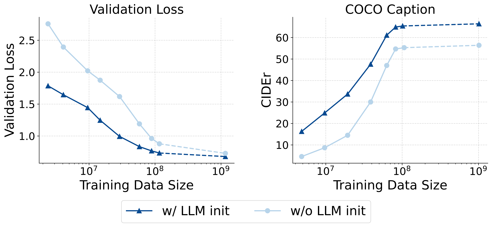
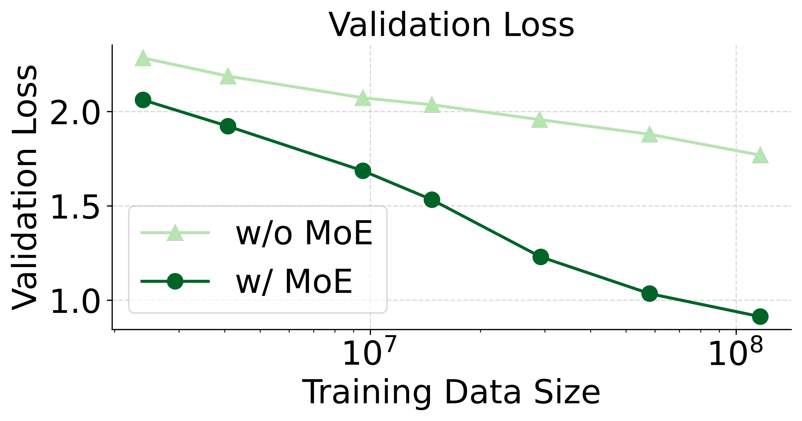
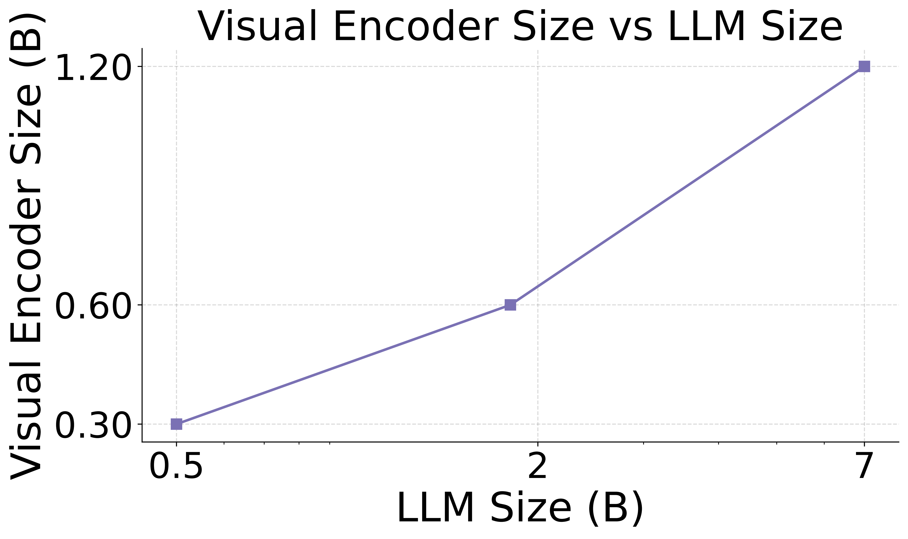
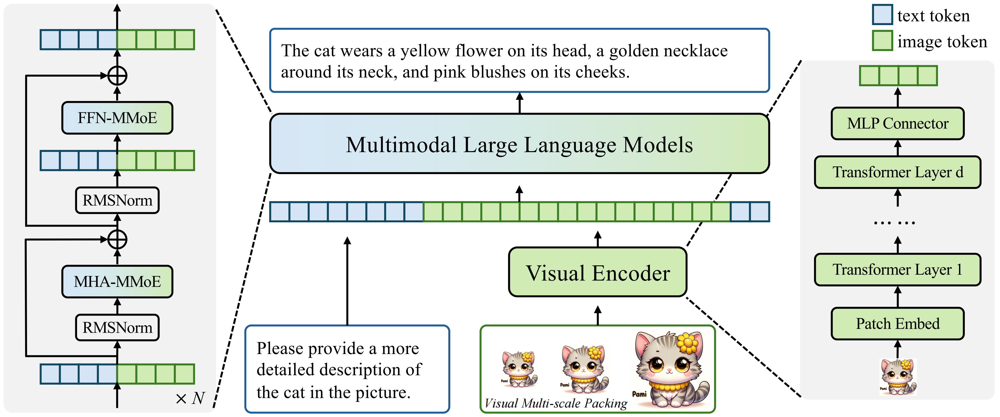
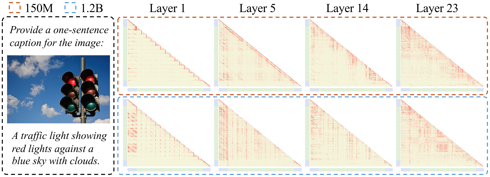

# NaViL: Rethinking Scaling Properties of Native Multimodal Large Language Models under Data Constraints (NeurIPS 2025)

[[📜 Paper]](https://arxiv.org/abs/2510.08565) [[⭐️Project Page]](https://internvl.github.io/blog/2025-10-10-NaViL/) [[🤗 Model]](https://huggingface.co/collections/OpenGVLab/navil-68e62e7d20ea3e4097b56778) [[📝 中文版]](README-zh.md)

## 📖 Abstract

In existing Multimodal Large Language Models (MLLMs), Compositional Training has become the mainstream paradigm, connecting pre-trained visual encoders and language models through continuous multimodal pre-training. However, due to its decoupled training approach, exploring the multimodal scaling properties of this paradigm is challenging.

In this paper, we focus on the Native Training of MLLMs in an end-to-end manner and systematically investigate the model design space and scaling properties under the practical scenario of data constraints. Through an in-depth study of various design choices in MLLMs, we identify a meta-architecture that optimally balances performance and training cost. Building on this, we further explore the scaling laws of native MLLMs and reveal a positive correlation in scaling between the visual encoder and the language model.

Based on these findings, we propose a native MLLM named **NaViL**, combined with a simple and cost-effective training scheme. Experimental results on 14 multimodal benchmarks confirm that NaViL's performance is comparable to state-of-the-art MLLMs. Our findings and contributions provide profound insights for future research on native MLLMs.

## 💡 Core Insights

We conducted a systematic study on the design and scaling properties of native MLLMs, leading to five key conclusions that guided the design of NaViL:

1.  **LLM Initialization is Crucial**: Initializing the model from a pre-trained LLM significantly accelerates the convergence of multimodal training. Its performance is generally superior to training from scratch, even with a large amount of multimodal data.

    <p align="center">
    
    </p>

2.  **MoE Architecture is Effective**: The Mixture-of-Experts (MoE) architecture can significantly enhance the model's ability to process heterogeneous data and improve overall performance without increasing inference costs (activated parameters). We found that introducing modality-specific experts for both attention and feed-forward networks (FFN) yields the best results.

    <p align="center">
    
    </p>

3.  **Flexibility of Visual Encoder Architecture**: For a given parameter budget, the performance of the visual encoder is nearly optimal across a wide range of depth and width configurations. Shallower encoders converge faster in the early stages of training, while deeper encoders perform slightly better with more data.

4.  **Asymmetric Scaling Effects**: Scaling up the LLM consistently improves multimodal performance, following traditional language model scaling laws. However, the benefits of scaling the visual encoder diminish, with its performance ceiling being constrained by the LLM's capacity.

5.  **Joint Scaling Law for Vision and Language**: Our research reveals for the first time that **the optimal scale of the visual encoder is directly proportional to the scale of the LLM on a logarithmic scale**. This implies that they should be scaled jointly and highlights the sub-optimality of existing compositional MLLMs that pair a fixed-size visual encoder with LLMs of different sizes.

    <p align="center">
    
    </p>

For more details, please refer to the original [paper](https://arxiv.org/abs/2510.08565).

## 🏗️ NaViL Architecture

Based on the insights above, we built NaViL. It is a native, MoE-based MLLM that can be trained end-to-end and natively supports images of arbitrary resolutions.

<p align="center">

</p>

-   **Visual Encoder**: Responsible for the initial extraction of visual information.
-   **MLP Connector**: Projects visual features into the LLM's feature space.
-   **MoE-extended LLM**: Contains modality-specific attention (MHA-MMoE) and feed-forward networks (FFN-MMoE) to fuse visual and text information more effectively.
-   **Visual Multi-scale Packing**: Further enhances model performance during inference by processing image inputs at multiple scales.

## 📊 Main Results

We conducted a comprehensive evaluation of NaViL on 14 mainstream multimodal benchmarks, covering general capabilities, visual question answering, OCR, chart, and document understanding.

### Comparison with SOTA Models

With comparable parameter sizes, NaViL-2B and NaViL-9B **surpass all existing native MLLMs in average performance** and achieve a level comparable to top-tier compositional MLLMs (e.g., InternVL-2.5, Qwen2.5-VL). This demonstrates the superiority of our proposed native training paradigm and scaling laws.

| Model | #A-Param | Avg | MMVet | MMMU | MMB | MME | MathVista | OCR-Bench | TextVQA | DocVQA | AI2D | ChartQA | InfoVQA |
| :--- | :--- | :--- | :--- | :--- | :--- | :--- | :--- | :--- | :--- | :--- | :--- | :--- | :--- |
| **_Compositional MLLMs_** |
| [Qwen2.5-VL](https://github.com/QwenLM/Qwen-VL) | 8.2B | 80.2 | 67.1 | 58.6 | 83.5 | 2347 | 68.2 | 864 | 84.9 | 95.7 | 83.9 | 87.3 | 82.6 |
| [InternVL-2.5](https://github.com/OpenGVLab/InternVL) | 8.1B | 77.3 | 62.8 | 56.0 | 84.6 | 2344 | 64.4 | 822 | 79.1 | 91.9 | 84.5 | 84.8 | 75.7 |
| **_Native MLLMs_** |
| [EVEv2](https://github.com/baaivision/EVE) | 7B | 62.3 | 45.0 | 39.3 | 66.3 | 1709 | 60.0* | 702 | 71.1 | 77.4* | 74.8 | 73.9 | 45.8* |
| [SAIL](https://github.com/ByteDance-Seed/SAIL) | 7B | 63.7 | 46.3 | 38.6* | 70.1 | 1719 | 57.0 | 783 | 77.1 | 78.4* | 76.7 | 69.7* | 47.3* |
| **NaViL-2B (ours)** | **2.4B** | **68.8** | **78.3** | **41.8** | **71.2** | **1822** | **50.0** | **796** | **76.9** | **85.4** | **74.6** | **78.0** | **56.0** |
| **NaViL-9B (ours)** | **9.2B** | **77.0** | **79.6** | **54.7** | **76.5** | **2225** | **66.7** | **837** | **77.2** | **90.6** | **82.4** | **85.4** | **70.2** |

> * \* denotes results tested locally using [VLMEvalKit](https://github.com/open-compass/VLMEvalKit) and [OpenCompass](https://rank.opencompass.org.cn/leaderboard-multimodal/?m=REALTIME).
> * The average score is computed by normalizing each metric to a range of 0-100.

### Qualitative Analysis

By visualizing attention maps, we found that a sufficiently large visual encoder (following our joint scaling law) helps the model focus on global information in shallower layers and promotes earlier interaction between visual and text features, which explains the performance improvement.

<p align="center">

</p>
* Top: Using a 150M visual encoder; Bottom: Using a 1.2B visual encoder. The latter exhibits stronger global attention and cross-modal interaction even in shallow layers (Layer 1).*

## 🚀 Getting Started

```bash
# 1. Clone the repository
git clone https://github.com/OpenGVLab/NaViL.git
cd NaViL

# 2. Create and activate the conda environment
conda create -n navil python=3.10 -y
conda activate navil

# 3. Install dependencies
pip install -r requirements.txt

# 4. run the inference demo

## 2B version
python -u demo.py --model_name_or_path OpenGVLab/NaViL-2B
## 9B version
python -u demo.py --model_name_or_path OpenGVLab/NaViL-9B
```

## ✨ Inference Example

Here is an example code for multimodal question answering with NaViL using the `transformers` library.

> Please use `transformers==4.51.0` to ensure the model works correctly.

<details>
<summary>Inference Example Code (Click to expand)</summary>

```python
import torch
from transformers import AutoTokenizer, AutoModel
from PIL import Image

def anyres_preprocess_multi_scale(images, image_processor, max_pixels=-1, min_pixels=-1, scale_downsample_ratio=0.7071):
    assert min_pixels > 0 and max_pixels > 0, 'min_pixels and max_pixels must be set'
    if not isinstance(images, list):
        images = [images]
    
    pixel_values_all, image_grid_thws_all, num_scales_all = [], [], []
    for image in images:
        ret = image_processor(image, return_tensors="pt", min_pixels=min_pixels, max_pixels=max_pixels)
        image_grid_thws = [ret['image_grid_thw'][0]]
        pixel_values = ret['pixel_values'].reshape(ret['image_grid_thw'].prod(), -1, image_processor.patch_size, image_processor.patch_size)

        while True:
            current_pixels = image_grid_thws[0].prod() * (image_processor.patch_size ** 2)
            max_pixels = current_pixels * (scale_downsample_ratio ** 2)
            if max_pixels < min_pixels:
                break
            ret = image_processor(image, return_tensors="pt", min_pixels=min_pixels, max_pixels=max_pixels)
            if ret['image_grid_thw'].prod() >= image_grid_thws[0].prod():
                break
            image_grid_thws.insert(0, ret['image_grid_thw'][0])
            pixel_values = torch.cat([ret['pixel_values'].reshape(ret['image_grid_thw'].prod(), -1, image_processor.patch_size, image_processor.patch_size), pixel_values], dim=0)
            
        pixel_values_all.append(pixel_values)
        image_grid_thws_all.extend(image_grid_thws)
        num_scales_all.append(len(image_grid_thws))
    pixel_values = torch.cat(pixel_values_all, dim=0)
    return pixel_values, image_grid_thws_all, num_scales_all


def load_image(
    image_files,
    image_processor,
    patch_size=16,
    max_num=24576,
    min_num=256,
    upscale=False,
    scale_downsample_ratio=0.7071,
):
    
    if not isinstance(image_files, list):
        image_files = [image_files]
    
    images = []
    for image_file in image_files:
        image = Image.open(image_file).convert('RGB')
        if upscale:
            image = image.resize((image.width * 2, image.height * 2), Image.BILINEAR)
        images.append(image)
    
    min_pixels = min_num * (patch_size ** 2)
    max_pixels = max_num * (patch_size ** 2)
    pixel_values, image_grid_thws, num_scales = anyres_preprocess_multi_scale(
                                                                images=images,
                                                                image_processor=image_processor,
                                                                max_pixels=max_pixels,
                                                                min_pixels=min_pixels,
                                                                scale_downsample_ratio=scale_downsample_ratio,
                                                            )

    image_grid_thws = torch.stack(image_grid_thws)
    num_scales = torch.tensor(num_scales)
    return pixel_values, image_grid_thws, num_scales


def load_model_tokenizer(model_path):
    tokenizer = AutoTokenizer.from_pretrained(model_path, trust_remote_code=True, use_fast=False)

    device = torch.cuda.current_device()
    model = AutoModel.from_pretrained(
        model_path,
        low_cpu_mem_usage=True,
        torch_dtype=torch.bfloat16,
        trust_remote_code=True,
        load_in_8bit=False
    ).eval()
    model.init_special_token_ids(tokenizer)

    # fix bug caused by size mismatch
    if hasattr(model.config, "tie_word_embeddings") and model.config.tie_word_embeddings:
        model.language_model.tie_weights()

    model = model.to(device)

    return model, tokenizer


def generate(message, model, tokenizer):
    image_num = len([x for x in message if x['type'] == 'image'])
    prompt = '\n'.join([x['value'] for x in message if x['type'] == 'text'])

    if image_num > 0:
        image_paths = [x['value'] for x in message if x['type'] == 'image']
        pixel_values, image_grid_thws, num_scales = load_image(
                                                                image_paths,
                                                                model.image_processor,
                                                                max_num=model.config.max_dynamic_patch,
                                                                min_num=model.config.min_dynamic_patch,
                                                                patch_size=model.config.vision_config.patch_size,
                                                                scale_downsample_ratio=model.config.scale_downsample_ratio,
                                                            )
        pixel_values = pixel_values.cuda().to(torch.bfloat16)
        image_grid_thws = image_grid_thws.cuda()
        num_scales = num_scales.cuda()
    else:
        pixel_values, image_grid_thws, num_scales = None, None, None

    generation_config = dict(do_sample=False, max_new_tokens=1024, top_p=None, num_beams=1)
    with torch.no_grad():
        try:
            response = model.chat(
                tokenizer,
                pixel_values=pixel_values,
                question=prompt,
                generation_config=generation_config,
                verbose=True,
                anyres_image_size=True,
                num_patches_list=image_grid_thws,
                num_scales=num_scales,
                )
        except Exception as e:
            print(f"Error in model chat: {e}")
            raise e
    return response

# --- Main Program ---
# Select the model to load
# model_path = "OpenGVLab/NaViL-2B"
model_path = "OpenGVLab/NaViL-9B"

print(f"Loading model from {model_path}...")
model, tokenizer = load_model_tokenizer(model_path)

# Prepare the input message
# The input format is a list of dictionaries, supporting multiple images and text segments
message = [
    {"type": "image", "value": "./examples/image1.jpg"},
    {"type": "text", "value": "Please describe the image shortly."},
]

print("Generating response...")
response = generate(message, model, tokenizer)

print("\n=== Response ===")
print(response)
```

</details>

## ✍️ How to Cite

If you find NaViL or our findings useful in your research, please consider citing our paper:

```bibtex
@article{tian2025navil,
  title={NaViL: Rethinking Scaling Properties of Native Multimodal Large Language Models under Data Constraints},
  author={Tian, Changyao and Li, Hao and Luo, Gen and Zhu, Xizhou and Su, Weijie and Deng, Hanming and Zhu, Jinguo and Shao, Jie and Zhu, Ziran and Liu, Yunpeng and Lu, Lewei and Wang, Wenhai and Li, Hongsheng and Dai, Jifeng},
  journal={arXiv preprint},
  year={2025}
}
```